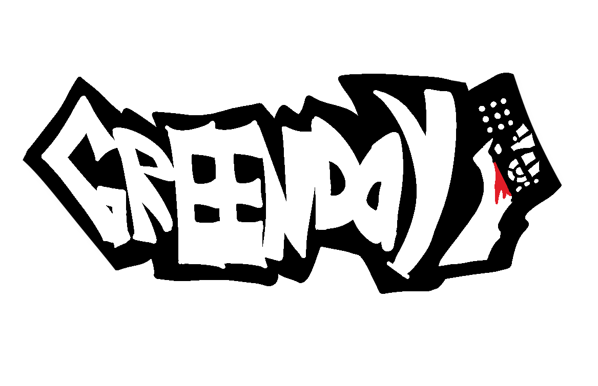

# Greenday
<p align="center">

</p>

> Uma aplicação moderna desenvolvida para simplificar a organização, o gerenciamento e o acompanhamento de rotinas e projetos.
## 📌 Sobre o Projeto

O **GreenDay** é um projeto criado para oferecer uma interface intuitiva, responsiva e agradável ao usuário, focando na performance e em uma excelente experiência de uso (UX/UI).

---

## 🚀 Tecnologias Utilizadas

O projeto foi desenvolvido com as seguintes tecnologias e ferramentas:

* **Front-End:** HTML5, CSS3, JavaScript (ES6+)
* **Controle de Versão:** Git & GitHub

---

## 🎨 Funcionalidades

- [x] Layout moderno e responsivo para diferentes tamanhos de tela.
- [x] Componentes e interface limpa e intuitiva.
- [x] Estrutura otimizada e organizada.

---

## 💻 Como Executar o Projeto

### Pré-requisitos

Você pode visitar o projeto em uma versão mais limitada pelo _Vercel_.
> https://greenday-alpha.vercel.app/
## 📂 Estrutura de Pastas
```bash 
greenday/
├── assets/          # Imagens, ícones e arquivos de mídia
├── css/             # Arquivos de estilização (CSS)
├── js/              # Scripts e lógica do projeto (JS)
├── index.html       # Página principal
└── README.md        # Documentação do projeto

